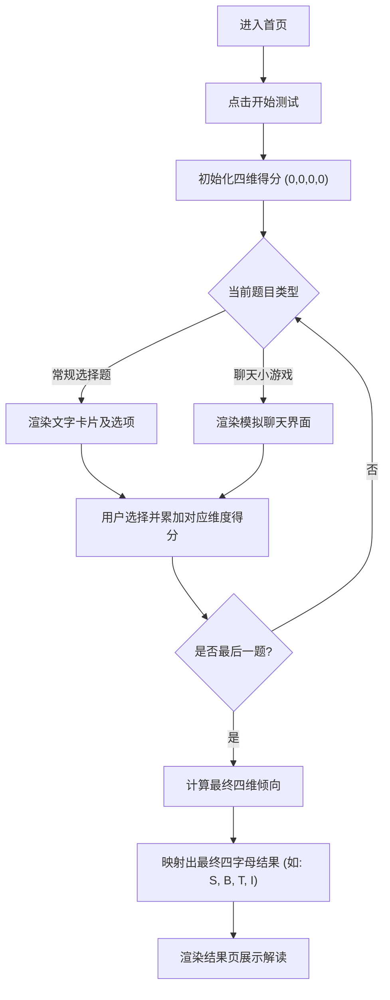

## 1. 产品概述
一款具有讽刺意味和互动性的“反PUA”测试网站。通过答题和模拟聊天场景小游戏，评估用户在情感操控面前的抵抗力，最终输出类似MBTI的抽象化四字人格结果（“SBTI”），帮助用户在娱乐中提高警惕。
- 核心目的是通过有趣、夸张、有代入感的交互，让用户识别常见的PUA话术和套路，了解自己的弱点。
- 目标用户是年轻群体，特别是容易陷入情感焦虑的单身男女。

## 2. 核心功能

### 2.1 角色定义
无需注册，所有访问者均可直接进行测试。

### 2.2 功能模块
1. **首页 (Home Page)**：夸张的标题（如“你是不是那个大冤种？”），醒目的开始测试按钮，以及简单的测试说明。
2. **测试引擎 (Assessment Page)**：包含两种题型：
   - 常规选择题：文字描述场景，用户选择反应。
   - 模拟聊天小游戏：展示一段类似微信聊天的对话，让用户从回复中选择最容易被PUA的一项，或者在对方发来PUA话术时选择“怼回去”的话。
3. **结果页 (Result Page)**：展示最终的四字“SBTI”防PUA人格（如：S-B-T-I 或 M-U-S-H），包含雷达图或属性条展示、具体人格解读、以及分享按钮。

### 2.3 页面详情
| 页面名称 | 模块名称 | 功能描述 |
|-----------|-------------|---------------------|
| 首页 | 引导区 | 动态大字排版，引人注目的标题，开始按钮，底部版权信息 |
| 测试页 | 进度条 | 显示当前题目进度（如 3/10） |
| 测试页 | 题目展示区 | 文字题卡片，或者模拟手机聊天框的UI界面 |
| 测试页 | 选项区 | 按钮列表，点击后触发过渡动画并进入下一题 |
| 结果页 | 评分展示区 | 炫酷的动态四字母结果展示（如老虎机滚动停下） |
| 结果页 | 解析区 | 对这四个维度的解读，以及防PUA建议 |
| 结果页 | 社交分享区 | 重新测试按钮，截图分享提示 |

## 3. 核心流程
用户进入网站 -> 浏览首页介绍 -> 点击开始测试 -> 依次回答10道题（含文字题和聊天小游戏） -> 系统根据选项计算4个维度的得分 -> 映射为四字人格（如SBTI） -> 展示结果页及防骗指南。

## 4. 用户界面设计
### 4.1 设计风格
- **整体风格**：Neo-Brutalism（新粗野主义），具有强烈视觉冲击力。大色块、粗黑边框、高对比度色彩（如亮黄、荧光粉、电光蓝、纯黑），适合“反PUA”这种带有反叛、警醒意味的主题。
- **主次颜色**：纯黑 (#000000) 为主边框和文字色，亮黄 (#FFDF00)、荧光绿 (#00FF41)、热粉色 (#FF007F) 为点缀色。背景可使用带有轻微噪点（Noise）的米白或亮色。
- **按钮样式**：粗黑边框，带明显的硬阴影（如 `box-shadow: 4px 4px 0px #000`），点击时产生下压动画（阴影消失，位置偏移）。
- **字体**：标题使用极具个性的无衬线粗体或像素风字体（如 ZCOOL KuHei 或有张力的特粗黑体），正文使用清晰现代的无衬线体。
- **交互动画**：使用 Framer Motion 实现硬核、弹跳感十足的切换动画。题目切换时带有卡片飞出/飞入效果。

### 4.2 页面设计概览
| 页面名称 | 模块名称 | UI 元素 |
|-----------|-------------|-------------|
| 首页 | 英雄区 | 超大加粗标题，滚动跑马灯背景，带硬阴影的巨大按钮 |
| 测试页 | 聊天框 | 仿微信气泡但采用粗框像素/漫画风格，对方是粉色/绿色气泡，己方是黄色气泡 |
| 结果页 | 结果海报 | 巨大的四个字母占满屏幕上半部分，配合故障风 (Glitch) 动画出现 |

### 4.3 响应式设计
采用移动端优先 (Mobile-first) 设计，同时适配桌面端。因为测试类H5网页主要通过手机社交软件传播，界面以竖屏卡片流为主，在桌面端则居中显示，两侧留白或使用装饰性图案。
